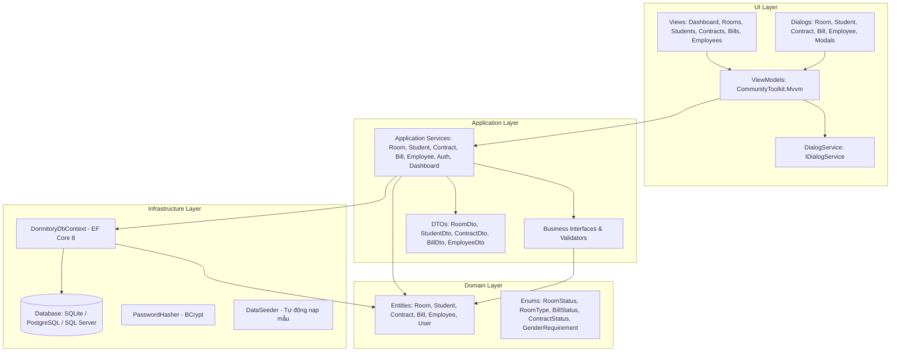

# 🏢 Hệ Thống Quản Lý Ký Túc Xá (Dormitory Management System)

> Ứng dụng Desktop hiện đại quản lý toàn diện Ký túc xá sinh viên, xây dựng trên nền tảng **.NET 8 LTS**, **Avalonia UI 11** và **Entity Framework Core 8** theo chuẩn kiến trúc **Clean Architecture** và mô hình **MVVM**.

---

## 📸 Giao Diện Người Dùng (Modern Desktop App)


---

## 🌟 Tính Năng Nổi Bật

1. **📊 Bảng Điều Khiển Tổng Quan & Biểu Đồ Trực Quan (Dashboard & LiveCharts2)**:
   - Thống kê thời gian thực: Tổng số phòng, số phòng trống, số sinh viên đang cư trú, hợp đồng hiệu lực.
   - Theo dõi tỷ lệ lấp đầy KTX (Occupancy Rate) với thanh tiến trình trực quan.
   - Thống kê doanh thu tiền phòng và điện nước đã thu trong tháng hiện tại.
   - Thẻ cảnh báo thông minh: Tự động phát hiện và cảnh báo các hợp đồng sắp hết hạn (trong vòng 30 ngày) và hóa đơn chưa thanh toán; tự động ẩn khi không có cảnh báo.
   - **Biểu đồ tròn tỷ lệ lấp đầy theo tòa (`PieChart`)**: Phân bổ sinh viên và công suất sử dụng giường từng tòa nhà kèm chú giải và Tooltip tương tác.
   - **Biểu đồ cột xu hướng doanh thu 6 tháng (`CartesianChart`)**: So sánh doanh thu Tiền phòng vs Điện nước/Dịch vụ qua từng tháng, định dạng tiền tệ VNĐ.
   - **Xuất báo cáo quản trị tổng hợp Excel**: Xuất toàn bộ KPI, công suất tòa nhà và dòng tiền 6 tháng ra tệp `.xlsx` 3 sheet chuẩn mực với ClosedXML.

2. **🏠 Quản Lý Phòng Ở (`Room`)**:
   - Quản lý danh mục phòng theo tòa nhà, số tầng, loại phòng (Tiêu chuẩn, Premium, VIP).
   - Phân chia giới tính phòng (Phòng Nam / Phòng Nữ) và tự động cập nhật sức chứa (`Available`, `Occupied`, `Maintenance`).
   - Hộp thoại **Thêm mới**, **Chỉnh sửa** phòng ở và **Xóa an toàn** có xác nhận người dùng.
   - **Xuất Excel**: Xuất toàn bộ danh sách phòng sang định dạng `.xlsx` chuyên nghiệp với ClosedXML.

3. **🎓 Quản Lý Hồ Sơ Sinh Viên (`Student`)**:
   - Quản lý đầy đủ thông tin: Mã sinh viên, họ tên, CCCD/CMND, quê quán, lớp, khoa, số điện thoại và thông tin liên hệ phụ huynh khẩn cấp.
   - Tìm kiếm nhanh đa tiêu chí (tên, mã số, CCCD, lớp, quê quán).
   - Hộp thoại **Thêm mới**, **Sửa hồ sơ** và **Xóa sinh viên** đồng bộ thời gian thực.
   - **Xuất Excel**: Xuất danh bạ hồ sơ sinh viên sang tệp `.xlsx` hỗ trợ báo cáo nhà trường.

4. **📝 Quản Lý Hợp Đồng Thuê Phòng (`Contract`)**:
   - Lập hợp đồng mới với ràng buộc tự động: Kiểm tra phòng còn chỗ, kiểm tra giới tính sinh viên phù hợp, đảm bảo sinh viên chưa có hợp đồng hiệu lực trùng lặp.
   - Tự động tăng/giảm sĩ số phòng khi ký hoặc thanh lý hợp đồng.
   - Chức năng **Ký hợp đồng mới**, **Gia hạn hợp đồng** và **Thanh lý hợp đồng** giải phóng sinh viên.
   - **Bộ lọc nâng cao**: Lọc hợp đồng theo trạng thái (*Tất cả, Đang hiệu lực, Hết hạn, Đã chấm dứt*).

5. **💵 Lập Hóa Đơn & Thu Tiền Dịch Vụ (`Bill`)**:
   - Hộp thoại lập hóa đơn trực quan với công thức tính điện nước tức thì (real-time meter calculation).
   - Tự động tính tiền điện theo chỉ số cũ/mới và đơn giá chuẩn (3.500 đ/kWh).
   - Tự động tính tiền nước theo mét khối và đơn giá (15.000 đ/m³).
   - Cộng dồn tiền phòng và phụ phí vệ sinh, internet vào tổng tiền thanh toán.
   - Thao tác **Thu tiền (Đã thanh toán)** cập nhật trạng thái `Paid` và tăng doanh thu tháng.
   - **Bộ lọc trạng thái**: Lọc nhanh hóa đơn theo trạng thái (*Tất cả, Chưa thanh toán, Đã thanh toán*).
   - **Xuất Excel**: Xuất sổ chi tiết hóa đơn dịch vụ hàng tháng sang bảng tính `.xlsx`.

6. **👥 Quản Lý Đội Ngũ Nhân Viên KTX (`Employee`)**:
   - Quản lý hồ sơ nhân sự vận hành: Mã NV, họ tên, chức vụ (Quản lý, Bảo vệ, Tạp vụ, Kỹ thuật,...), số điện thoại, email, CCCD, mức lương cơ bản và ngày vào làm.
   - Tìm kiếm đa tiêu chí theo tên, mã nhân viên, chức danh hoặc số điện thoại.
   - Đầy đủ thao tác **Thêm nhân viên mới**, **Chỉnh sửa thông tin** và **Xóa nhân viên** với hộp thoại xác nhận.
   - **Bảo mật phân quyền**: Chỉ tài khoản Quản trị viên (`Admin`) mới có quyền truy cập phân hệ này.

7. **🔐 Xác Thực & Quản Lý Phiên Làm Việc (Authentication & Session)**:
   - Màn hình đăng nhập hiện đại với xác thực mật khẩu băm an toàn (BCrypt).
   - Quản lý phiên làm việc (`IUserSession`), hiển thị thông tin tài khoản và vai trò trên giao diện.
   - Chức năng **Đăng xuất an toàn** đưa người dùng trở về màn hình đăng nhập.
   - Phân quyền theo vai trò (RBAC): `Admin` có toàn quyền hệ thống; `Manager` quản lý vận hành thường nhật.

8. **⚙️ Cài Đặt Hệ Thống & Sao Lưu/Phục Hồi CSDL (System Settings & Backup)**:
   - Giám sát trạng thái file CSDL SQLite thời gian thực: đường dẫn, dung lượng đĩa, tổng số bản ghi từ toàn bộ các bảng trong hệ thống.
   - Sao lưu snapshot CSDL an toàn ra file `.bak` sử dụng SQLite Online Backup API không làm gián đoạn các giao dịch đọc/ghi.
   - Phục hồi CSDL an toàn với cơ chế kiểm tra tính toàn vẹn (`PRAGMA integrity_check`) và hộp thoại xác nhận.
   - Cấu hình chuỗi kết nối động qua `appsettings.json` với cơ chế dự phòng an toàn (Safe Fallback).
   - Phân quyền Quản trị viên (RBAC): Chỉ `Admin` mới có quyền truy cập và thao tác phục hồi dữ liệu.

9. **📦 Đóng Gói & Triển Khai Đa Nền Tảng (Cross-Platform Packaging)**:
   - Bộ kịch bản tự động đóng gói ứng dụng độc lập (Self-Contained Deployment), người dùng tải về chạy ngay (Zero Setup).
   - **macOS**: App Bundle chuẩn (`DormitoryManager.app`) & tệp ảnh đĩa `.dmg` (hỗ trợ cả Apple Silicon ARM64 và Intel x64).
   - **Windows**: Single-File Executable `.exe` đóng gói trong tệp `.zip` tiện dụng.
   - **Linux**: Gói nhị phân độc lập `.tar.gz` kèm native libraries tương thích các bản phân phối Ubuntu, Debian, Fedora.
   - Hướng dẫn triển khai và mẫu GitHub Actions CI/CD hoàn chỉnh tại [docs/packaging-and-deployment.md](docs/packaging-and-deployment.md).

10. **🪟 Hạ Tầng Dialog, Xuất Báo Cáo & Xác Nhận Chuẩn Mực**:
    - Dịch vụ hộp thoại phi tập trung (`IDialogService`) và chọn tệp lưu trữ (`IFileService`).
    - Cửa sổ xác nhận an toàn (`ConfirmDialogWindow`) và thông báo (`MessageDialogWindow`) ngăn chặn xóa nhầm dữ liệu.

---

## 📋 Bảng Tổng Hợp Trạng Thái Chức Năng (Feature & CRUD Matrix - Hoàn Thành 100% 3 Giai Đoạn)

| Phân hệ Nghiệp Vụ | Xem Danh Sách | Thêm Mới (Create) | Chỉnh Sửa (Update) | Xóa / Hủy (Delete) | Tìm Kiếm / Lọc | Xuất Excel | Phân Quyền | Trạng Thái |
| :--- | :---: | :---: | :---: | :---: | :---: | :---: | :---: | :---: |
| **Xác thực & Phiên (Auth)** | ✅ | — | — | — | — | — | Admin / Manager | **Hoàn thành (Phase 1)** |
| **Bảng Điều Khiển (Dashboard)** | ✅ | — | — | — | ✅ (Cảnh báo Live & Lọc) | ✅ (`.xlsx` Đa Sheet) | Tất cả | **Hoàn thành (Phase 2 - LiveCharts2 & Analytics)** |
| **Phòng Ở (Rooms)** | ✅ | ✅ (`RoomDialog`) | ✅ (`RoomDialog`) | ✅ (Xác nhận an toàn) | ✅ | ✅ (`.xlsx`) | Tất cả | **Hoàn thành (Phase 1)** |
| **Sinh Viên (Students)** | ✅ | ✅ (`StudentDialog`) | ✅ (`StudentDialog`) | ✅ (Xác nhận an toàn) | ✅ (Đa tiêu chí) | ✅ (`.xlsx`) | Tất cả | **Hoàn thành (Phase 1)** |
| **Hợp Đồng (Contracts)** | ✅ | ✅ (`ContractDialog`) | ✅ (Gia hạn HĐ) | ✅ (Thanh lý & Giải phóng) | ✅ (Lọc trạng thái) | — | Tất cả | **Hoàn thành (Phase 1)** |
| **Hóa Đơn & Điện Nước (Bills)** | ✅ | ✅ (`BillDialog` tự động) | — | — | ✅ (Lọc trạng thái) | ✅ (`.xlsx`) | Tất cả | **Hoàn thành (Phase 1)** |
| **Nhân Viên KTX (Employees)** | ✅ | ✅ (`EmployeeDialog`) | ✅ (`EmployeeDialog`) | ✅ (Xác nhận an toàn) | ✅ (Đa tiêu chí) | — | **Chỉ Admin** | **Hoàn thành (Phase 1)** |
| **Cài Đặt Hệ Thống & Quản Trị CSDL** | ✅ | ✅ (Sao lưu `.bak`) | ✅ (Phục hồi CSDL) | — | ✅ (Kiểm tra toàn vẹn) | — | **Chỉ Admin** | **Hoàn thành (Phase 3 - Infrastructure & Packaging)** |
| **Đóng Gói & Triển Khai Đa Nền Tảng** | ✅ | ✅ (macOS DMG) | ✅ (Win ZIP / Exe) | ✅ (Linux Tar.gz) | — | — | DevOps / Admin | **Hoàn thành (Phase 3 - Infrastructure & Packaging)** |

---

## 🏗️ Kiến Trúc Hệ Thống (Clean Architecture + MVVM)

Hệ thống được thiết kế theo mô hình 4 tầng phân tách trách nhiệm chặt chẽ:



### Cấu Trúc Thư Mục

```
Dormitory-Manager/
├── dist/                             # Thư mục chứa gói xuất bản thành phẩm (DMG, ZIP, TAR.GZ)
├── docs/                             # Tài liệu kỹ thuật, hướng dẫn sử dụng & ảnh chụp
│   ├── images/                       # Ảnh chụp giao diện dashboard
│   ├── packaging-and-deployment.md   # Hướng dẫn đóng gói và triển khai đa nền tảng
│   ├── spec-modernization.md         # Đặc tả kiến trúc hiện đại hóa
│   ├── user-guide.md                 # Hướng dẫn sử dụng chi tiết các phân hệ
│   └── superpowers/plans/            # Kế hoạch triển khai kỹ thuật
│
├── scripts/
│   └── package/                      # Bộ kịch bản tự động đóng gói đa nền tảng
│       ├── build-macos.sh            # Đóng gói macOS App Bundle & tệp DMG (ARM64 & x64)
│       ├── build-windows.sh          # Đóng gói Windows Single-File EXE & ZIP (win-x64)
│       └── build-linux.sh            # Đóng gói Linux Self-Contained Binary & Tar.gz
│
├── src/
│   ├── Dormitory.Core/               # Domain: Thực thể và Enums nghiệp vụ (Room, Student, Contract, Bill, Employee, User)
│   ├── Dormitory.Application/        # Application: DTOs, Services, Interfaces, Business Logic
│   ├── Dormitory.Infrastructure/     # Data Access: EF Core SQLite, Migrations, BCrypt, DataSeeder, DatabaseService
│   └── Dormitory.Desktop/            # Presentation: Avalonia UI 11, FluentTheme, MVVM, Dialogs, appsettings.json
│
├── tests/
│   └── Dormitory.UnitTests/          # Kiểm thử tự động xUnit (46/46 Passed - 100%)
│
├── Dormitory.sln                     # .NET 8 Solution
└── README.md
```

---

## 🚀 Hướng Dẫn Cài Đặt & Chạy Ứng Dụng

### Yêu Cầu Môi Trường
- **.NET 8 SDK** (hoặc mới hơn) cài đặt trên máy phát triển.
- Hệ điều hành: **macOS** (Apple Silicon / Intel), **Windows 10/11**, hoặc **Linux**.

### Khởi Chạy Ứng Dụng Desktop (Môi Trường Phát Triển)

Chỉ cần mở Terminal tại thư mục gốc dự án và chạy:

```bash
# 1. Khôi phục packages và build toàn bộ Solution
dotnet build Dormitory.sln

# 2. Khởi chạy ứng dụng Desktop
dotnet run --project src/Dormitory.Desktop
```

> 💡 **Ghi chú**: Trong lần khởi chạy đầu tiên, hệ thống sẽ tự động tạo database SQLite cục bộ `dormitory.db` và nạp sẵn dữ liệu mẫu (danh sách phòng, sinh viên, hợp đồng, hóa đơn, nhân viên và tài khoản quản trị).

### Tài Khoản Đăng Nhập Mặc Định
- **Quản trị viên (Admin)**: `admin` / `Admin@123456`
- **Quản lý (Manager)**: `manager` / `Manager@123`

### 📦 Đóng Gói Ứng Dụng Đa Nền Tảng (Cross-Platform Packaging)

Hệ thống cung cấp sẵn các kịch bản đóng gói tự động thành các gói phần mềm độc lập (Self-Contained Deployment - SCD), không yêu cầu người dùng cuối cài đặt trước .NET Runtime:

```bash
# 1. Đóng gói cho macOS (tự nhận diện chip Apple Silicon hoặc Intel, tạo DormitoryManager.app & .dmg):
./scripts/package/build-macos.sh

# 2. Đóng gói cho Windows (tạo Single-File Dormitory.Desktop.exe & file nén .zip):
./scripts/package/build-windows.sh

# 3. Đóng gói cho Linux (tạo gói nhị phân độc lập DormitoryManager-...-Linux-x64.tar.gz):
./scripts/package/build-linux.sh
```

Thành phẩm sau khi đóng gói sẽ nằm tại thư mục `dist/`.
> 📖 Tham khảo hướng dẫn cài đặt và triển khai chi tiết cho từng hệ điều hành tại [**docs/packaging-and-deployment.md**](docs/packaging-and-deployment.md).

---

## 🧪 Chạy Kiểm Thử Tự Động (Unit Tests)

Dự án bao gồm bộ kiểm thử tự động kiểm tra chặt chẽ toàn diện: logic tính toán hóa đơn, quy tắc ràng buộc phòng, quản lý hợp đồng, nghiệp vụ nhân viên, mã hóa mật khẩu, dịch vụ xuất báo cáo Excel ClosedXML, và dịch vụ sao lưu/phục hồi/kiểm tra toàn vẹn CSDL SQLite (`IDatabaseService`):

```bash
dotnet test tests/Dormitory.UnitTests
```

Kết quả: **46/46 Tests Passed** (100% Pass).

