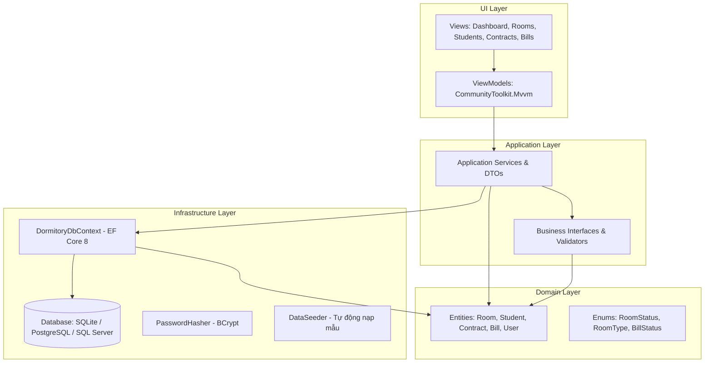

# 🏢 Hệ Thống Quản Lý Ký Túc Xá (Dormitory Management System)

> Ứng dụng Desktop hiện đại quản lý toàn diện Ký túc xá sinh viên, xây dựng trên nền tảng **.NET 8 LTS**, **Avalonia UI 11** và **Entity Framework Core 8** theo chuẩn kiến trúc **Clean Architecture** và mô hình **MVVM**.

---

## 📸 Giao Diện Người Dùng (Modern Dashboard)


---

## 🌟 Tính Năng Nổi Bật

1. **📊 Bảng Điều Khiển Tổng Quan (Dashboard)**:
   - Thống kê thời gian thực: Tổng số phòng, số phòng trống, số sinh viên đang cư trú, hợp đồng hiệu lực.
   - Theo dõi tỷ lệ lấp đầy KTX (Occupancy Rate) với thanh tiến trình trực quan.
   - Thống kê doanh thu tiền phòng và điện nước đã thu trong tháng hiện tại.
   - Cảnh báo các hóa đơn chưa thu cần đôn đốc.

2. **🏠 Quản Lý Phòng Ở (`Room`)**:
   - Quản lý danh mục phòng theo tòa nhà, số tầng, loại phòng (Tiêu chuẩn, Premium, VIP).
   - Phân chia giới tính phòng (Phòng Nam / Phòng Nữ) và tự động cập nhật sức chứa (`Available`, `Occupied`, `Maintenance`).

3. **🎓 Quản Lý Hồ Sơ Sinh Viên (`Student`)**:
   - Quản lý đầy đủ thông tin: Mã sinh viên, họ tên, CCCD/CMND, quê quán, lớp, khoa, số điện thoại và thông tin liên hệ phụ huynh khẩn cấp.
   - Tìm kiếm nhanh đa tiêu chí (tên, mã số, CCCD, lớp).

4. **📝 Quản Lý Hợp Đồng Thuê Phòng (`Contract`)**:
   - Lập hợp đồng mới với ràng buộc tự động: Kiểm tra phòng còn chỗ, kiểm tra giới tính sinh viên phù hợp, đảm bảo sinh viên chưa có hợp đồng hiệu lực trùng lặp.
   - Tự động tăng/giảm sĩ số phòng khi ký hoặc thanh lý hợp đồng.

5. **💵 Lập Hóa Đơn & Thu Tiền Dịch Vụ (`Bill`)**:
   - Tự động tính tiền điện theo chỉ số cũ/mới và đơn giá tiêu chuẩn.
   - Tự động tính tiền nước theo mét khối và đơn giá.
   - Cộng dồn tiền phòng và phụ phí vệ sinh, internet.
   - Theo dõi trạng thái nộp tiền (`Chưa thanh toán`, `Đã thanh toán`) và ngày đến hạn.

---

## 🏗️ Kiến Trúc Hệ Thống (Clean Architecture + MVVM)

Hệ thống được thiết kế theo mô hình 4 tầng phân tách trách nhiệm chặt chẽ:



### Cấu Trúc Thư Mục

```
Dormitory-Manager/
├── docs/                             # Tài liệu kỹ thuật & hình ảnh giao diện
│   ├── images/                       # Ảnh chụp giao diện dashboard
│   ├── spec-modernization.md         # Đặc tả kiến trúc hiện đại hóa
│   └── superpowers/plans/            # Kế hoạch triển khai chi tiết
│
├── src/
│   ├── Dormitory.Core/               # Domain: Thực thể và Enums nghiệp vụ
│   ├── Dormitory.Application/        # Application: DTOs, Services, Interfaces
│   ├── Dormitory.Infrastructure/     # Data Access: EF Core SQLite, Migrations, BCrypt
│   └── Dormitory.Desktop/            # Presentation: Avalonia UI 11, FluentTheme, MVVM
│
├── tests/
│   └── Dormitory.UnitTests/          # Kiểm thử tự động (xUnit + FluentAssertions)
│
├── Dormitory.sln                     # .NET 8 Solution
└── README.md
```

---

## 🚀 Hướng Dẫn Cài Đặt & Chạy Ứng Dụng

### Yêu Cầu Môi Trường
- **.NET 8 SDK** (hoặc mới hơn) cài đặt trên máy.
- Hệ điều hành: **macOS** (Apple Silicon / Intel), **Windows 10/11**, hoặc **Linux**.

### Khởi Chạy Ứng Dụng Desktop

Chỉ cần mở Terminal tại thư mục gốc dự án và chạy:

```bash
# 1. Khôi phục packages và build toàn bộ Solution
dotnet build Dormitory.sln

# 2. Khởi chạy ứng dụng Desktop
dotnet run --project src/Dormitory.Desktop
```

> 💡 **Ghi chú**: Trong lần khởi chạy đầu tiên, hệ thống sẽ tự động tạo database SQLite cục bộ `dormitory.db` và nạp sẵn dữ liệu mẫu (danh sách phòng, sinh viên, hợp đồng và tài khoản quản trị).

### Tài Khoản Đăng Nhập Mặc Định
- **Quản trị viên (Admin)**: `admin` / `Admin@123456`
- **Quản lý (Manager)**: `manager` / `Manager@123`

---

## 🧪 Chạy Kiểm Thử Tự Động (Unit Tests)

Dự án bao gồm bộ kiểm thử tự động kiểm tra chặt chẽ các logic tính toán hóa đơn, quy tắc ràng buộc phòng và mã hóa mật khẩu:

```bash
dotnet test tests/Dormitory.UnitTests
```
