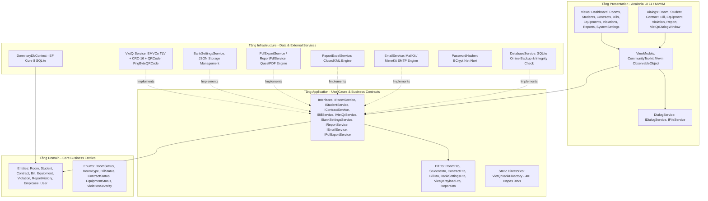
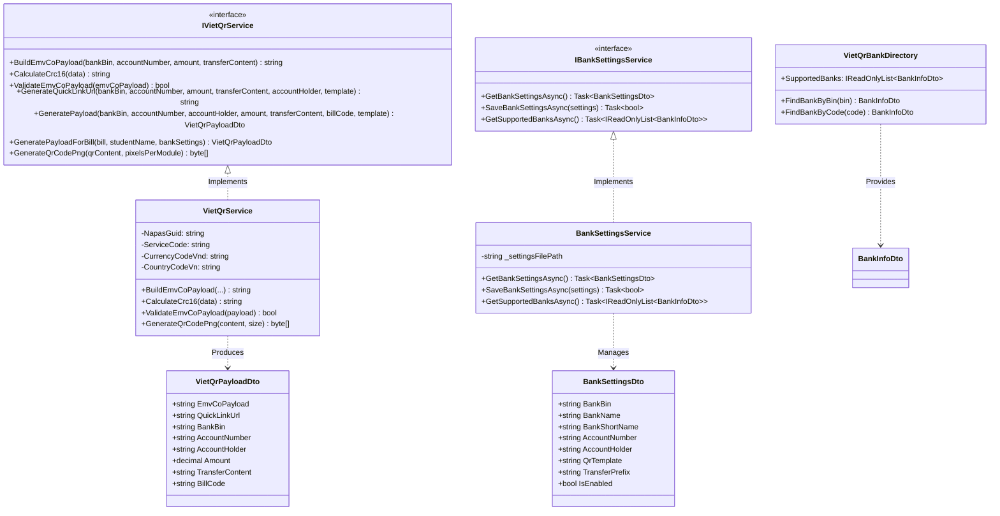
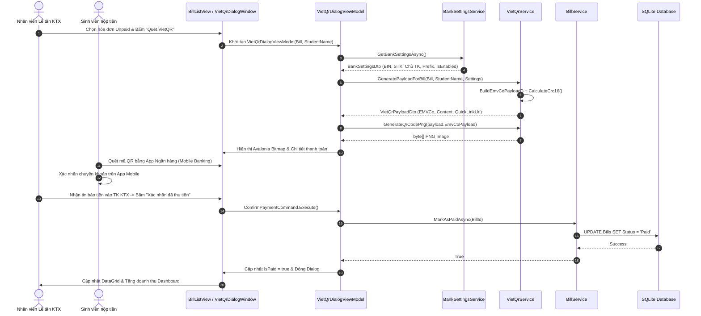

# Tài Liệu Kiến Trúc Phần Mềm: Dormitory Management

## 1. Nguyên Tắc Thiết Kế
Hệ thống được thiết kế tuân thủ nguyên tắc **Clean Architecture** của Robert C. Martin kết hợp mô hình **Model-View-ViewModel (MVVM)** cho tầng Presentation:
- **Tính độc lập với Framework**: Tầng Domain (`Dormitory.Core`) không phụ thuộc vào bất kỳ framework ORM hoặc UI nào.
- **Tính độc lập với Giao diện (UI)**: UI có thể thay thế (Avalonia UI, WPF, hoặc Web) mà không ảnh hưởng tới Business Logic.
- **Tính độc lập với Cơ sở dữ liệu**: EF Core trừu tượng hóa việc truy vấn, dễ dàng chuyển đổi giữa SQLite, PostgreSQL và SQL Server.
- **Kiểm thử dễ dàng (Testability)**: Các quy tắc nghiệp vụ trong `Dormitory.Application` được kiểm thử độc lập mà không cần khởi động UI hay kết nối Database thật (thông qua Unit Tests & Headless UI Tests).

---

## 2. Sơ Đồ Kiến Trúc Hệ Thống Tổng Thể

---

## 3. Trách Nhiệm Của Từng Tầng

| Tầng (Project) | Trách nhiệm chính | Thư viện & Công nghệ |
| :--- | :--- | :--- |
| **`Dormitory.Core`** | Chứa Entities, Enums, Value Objects và các quy tắc Domain cốt lõi. Hoàn toàn độc lập với các thư viện bên ngoài. | .NET 8 BCL (Không có dependency ngoài) |
| **`Dormitory.Application`** | Chứa DTOs, Business Interfaces (`IVietQrService`, `IBankSettingsService`, `IBillService`,...), quy tắc nghiệp vụ, danh mục ngân hàng tĩnh (`VietQrBankDirectory`). | `Microsoft.EntityFrameworkCore` (Abstractions) |
| **`Dormitory.Infrastructure`** | Hiện thực hóa các dịch vụ: EF Core SQLite DbContext, `VietQrService` (EMVCo + CRC-16 + QRCoder), `BankSettingsService`, QuestPDF, ClosedXML, MailKit SMTP, BCrypt, SQLite Online Backup. | `Microsoft.EntityFrameworkCore.Sqlite`, `QRCoder`, `QuestPDF`, `ClosedXML`, `MailKit`, `BCrypt.Net-Next` |
| **`Dormitory.Desktop`** | Giao diện đồ họa đa nền tảng (macOS, Windows, Linux), điều phối ViewModel, Data Binding, Navigation, Dialogs (`VietQrDialogWindow`, `SystemSettingsView`,...). | `Avalonia 11`, `Avalonia.Themes.Fluent`, `CommunityToolkit.Mvvm`, `LiveChartsCore.SkiaSharpView.Avalonia` |
| **`Dormitory.UnitTests`** | Kiểm thử đơn vị & tích hợp: logic hóa đơn, thuật toán VietQR EMVCo/CRC-16, xuất PDF/Excel, phân quyền, bảo mật (283 bài test). | `xUnit`, `FluentAssertions`, `Moq`, `EF Core InMemory` |
| **`Dormitory.E2ETests`** | Kiểm thử hành trình người dùng E2E headless hoàn toàn tự động không cần màn hình hiển thị (11 hành trình). | `Avalonia.Headless.XUnit` |

---

## 4. Kiến Trúc Chi Tiết Phân Hệ Thanh Toán VietQR Động (Phase 8)

Phân hệ **VietQR Payment** được thiết kế nhằm tự động hóa quy trình thu tiền phòng và điện nước thông qua mã QR động chuẩn quốc gia **NAPAS 247** và đặc tả quốc tế **EMVCo QR Code Specification**.

### 4.1. Cấu Trúc Các Lớp Trong Phân Hệ VietQR

### 4.2. Đặc Tả Kỹ Thuật Sinh Chuỗi EMVCo & Checksum CRC-16 (100% Offline)

Chuỗi dữ liệu VietQR được đóng gói theo cấu trúc **Tag-Length-Value (TLV)** với định dạng:
`[Tag: 2 ký tự][Length: 2 ký tự số][Value: n ký tự]`

Các thẻ dữ liệu tiêu chuẩn theo đặc tả EMVCo QR Code & Napas 247:
- **Tag 00 (Payload Format Indicator)**: Giá trị `"01"` (Chiều dài `02`).
- **Tag 01 (Point of Initiation Method)**: Giá trị `"12"` đại diện cho mã QR động (Dynamic QR Code - có số tiền gắn liền).
- **Tag 38 (Merchant Account Information)**: Chứa thông tin thụ hưởng Napas:
  - Sub-tag `00`: GUID Napas = `"A000000727"`
  - Sub-tag `01`: Tổ chức thụ hưởng (Beneficiary Organization) gồm Sub-tag `00` (Mã Napas BIN 6 chữ số) và Sub-tag `01` (Số tài khoản thụ hưởng).
  - Sub-tag `02`: Service Code = `"QRIBFTTA"` (Dịch vụ chuyển nhanh Napas 247 tới tài khoản).
- **Tag 53 (Transaction Currency)**: Giá trị `"704"` (Đồng Việt Nam - VNĐ theo ISO 4217).
- **Tag 54 (Transaction Amount)**: Số tiền phải thanh toán theo hóa đơn (làm tròn số nguyên không phân cách thập phân).
- **Tag 58 (Country Code)**: Giá trị `"VN"` (Mã quốc gia Việt Nam theo ISO 3166-1).
- **Tag 62 (Additional Data Field Template)**: Chứa thông tin bổ sung giao dịch:
  - Sub-tag `08`: Nội dung chuyển khoản chuẩn hóa (được làm sạch ký tự đặc biệt, tối đa 25 ký tự không dấu).
- **Tag 63 (CRC-16 Checksum)**: Mã kiểm tra toàn vẹn chuỗi.

#### Thuật Toán CRC-16/CCITT-FALSE
Mã checksum CRC-16 được tính toán trực tiếp trên toàn bộ chuỗi tiền tố kết thúc bằng `"6304"`:
- **Đa thức (Polynomial)**: `0x1021` ($x^{16} + x^{12} + x^5 + 1$).
- **Giá trị khởi tạo (Initial Value)**: `0xFFFF`.
- **Cơ chế dịch bit (Bit-shifting)**: Xử lý từng byte ASCII, XOR vào byte cao, dịch trái 8 bit và kiểm tra bit dấu để thực hiện XOR với đa thức.
- **Định dạng kết quả**: Chuỗi thập lục phân 4 ký tự viết hoa (Hex 4-digits uppercase, ví dụ `E3B2`).

Toàn bộ thuật toán chạy 100% cục bộ, tốc độ tính toán dưới 1ms, không phụ thuộc vào Internet hay bất kỳ API bên ngoài nào.

### 4.3. Động Cơ Sinh Ảnh Mã QR Offline (QRCoder)

Bên cạnh URL trực tuyến QuickLink (`https://img.vietqr.io/image/{BIN}-{ACC}-{TEMPLATE}.png?amount={AMOUNT}&addInfo={CONTENT}`), hệ thống tích hợp động cơ sinh ảnh mã QR offline:
- Sử dụng thư viện **`QRCoder`** với bộ kết xuất `PngByteQRCode`.
- Chuyển đổi chuỗi payload EMVCo hợp lệ thành ma trận điểm ảnh với mức sửa sai ECC (Error Correction Level) tiêu chuẩn.
- Kết xuất trực tiếp thành mảng byte `byte[]` định dạng tệp ảnh PNG chuẩn mực.
- Được sử dụng để:
  1. Nạp trực tiếp vào Avalonia UI qua `new Bitmap(new MemoryStream(qrBytes))` trong `VietQrDialogWindow`.
  2. Nhúng ảnh byte PNG vào tài liệu PDF phiếu thu thông qua `QuestPDF.Fluent.Image(qrBytes)`.
  3. Cung cấp tính năng lưu ảnh mã QR ra đĩa (`SaveQrImageCommand`) cho người dùng.

---

## 5. Luồng Dữ Liệu Thanh Toán Tại Quầy & Tích Hợp Đa Phân Hệ

### 5.1. Sơ Đồ Tuần Tự (Sequence Diagram) - Quét Mã VietQR Tại Quầy Lễ Tân

### 5.2. Tích Hợp Với Phiếu Thu PDF QuestPDF
Khi người dùng kích hoạt xuất phiếu thu PDF (`IPdfExportService.GenerateBillReceiptPdfAsync`):
1. `PdfExportService` gọi `IBankSettingsService` để kiểm tra cờ `IsEnabled`.
2. Nếu tính năng VietQR đang bật, dịch vụ gọi `IVietQrService.GeneratePayloadForBill(...)` để sinh chuỗi EMVCo và gọi `IVietQrService.GenerateQrCodePng(...)` để tạo mảng byte ảnh QR PNG.
3. Trong tài liệu QuestPDF, khối thanh toán được vẽ tại góc phải bên dưới bảng chi tiết hóa đơn:
   - Hiển thị ảnh mã QR kích thước chuẩn (110x110 pt).
   - Hiển thị tên ngân hàng, số tài khoản, chủ tài khoản và ghi chú chuyển khoản.
   - Khi in ra giấy hoặc mở file PDF, người nộp tiền có thể quét trực tiếp để thanh toán.

### 5.3. Tích Hợp Với Email Thông Báo Hóa Đơn MailKit
Khi người dùng kích hoạt gửi email hóa đơn (`IEmailService.SendBillInvoiceEmailAsync`):
1. `EmailService` truy vấn cấu hình ngân hàng thụ hưởng qua `IBankSettingsService`.
2. Dịch vụ chèn khối thông tin VietQR vào mẫu email HTML với giao diện trang trọng:
   - Nhúng liên kết ảnh QuickLink hoặc mã QR hiển thị trực quan trong email.
   - Hướng dẫn cú pháp chuyển khoản chính xác kèm số tiền nợ.
3. Tự động đính kèm tệp PDF phiếu thu đã tích hợp mã QR gửi trực tiếp vào hòm thư điện tử của sinh viên.

---

## 6. Chiến Lược Kiểm Thử & Đảm Bảo Độ Tin Cậy (Quality Assurance)

Hệ thống duy trì kiểm thử 2 tầng đạt tỷ lệ **100% Pass (294/294 bài test)**:
1. **Kiểm thử Đơn vị & Tích hợp (283 Unit Tests)**:
   - Kiểm thử toàn diện thuật toán sinh chuỗi TLV EMVCo, xác thực định dạng, kiểm tra checksum CRC-16 với vector kiểm thử chuẩn.
   - Kiểm thử engine QRCoder sinh mảng byte PNG hợp lệ (bắt đầu bằng magic bytes `0x89, 0x50, 0x4E, 0x47`).
   - Kiểm thử lưu/đọc cấu hình ngân hàng JSON và tra cứu 40+ mã ngân hàng Napas BIN.
   - Kiểm thử ViewModels: `VietQrDialogViewModel`, `BillListViewModel`, `SystemSettingsViewModel`.
2. **Kiểm thử Giao diện Tự động Headless (11 E2E Journeys)**:
   - 11 kịch bản kiểm thử toàn diện giao diện không cần màn hình (`Avalonia.Headless.XUnit`), bao phủ từ đăng nhập, quản lý tài sản, xuất PDF, lịch sử báo cáo, đến quy trình quét mã VietQR tại quầy lễ tân, thay đổi cấu hình ngân hàng, thử nghiệm sinh mã QR và xử lý an toàn khi tính năng bị tắt.
