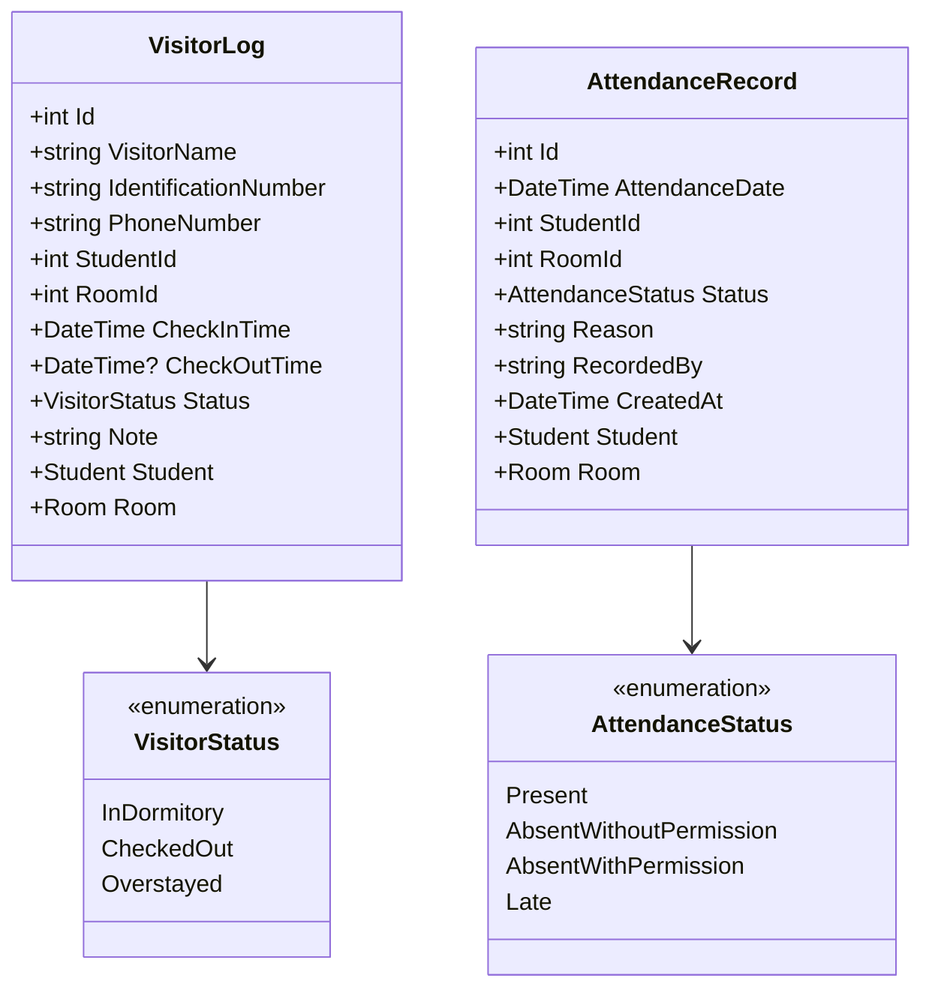

# Kế Hoạch Triển Khai Phase 10: Quản Lý Khách Ra Vào & Điểm Danh Sinh Viên (Visitor & Attendance Tracking)

> **Mục tiêu:** Xây dựng phân hệ an ninh trật tự quản lý toàn diện lịch sử khách đến thăm ký túc xá, tự động cảnh báo khách lưu trú quá giờ giới nghiêm (22:00), cùng hệ thống điểm danh chuyên cần sinh viên ban đêm theo phòng với thống kê tỷ lệ vắng mặt tự động.
> **Phiên bản dự kiến:** `v2.6.0`  
> **Quy chuẩn mã nguồn:** Định danh (classes, interfaces, methods, properties) 100% tiếng Anh; Chú thích, XML doc, thông báo và UI 100% tiếng Việt; Thời gian sử dụng `DateTime.UtcNow`.

---

## 🏗️ Tổng Quan Kiến Trúc & Thiết Kế Thực Thể

---

## 📋 Danh Sách Các Task Triển Khai

### Task 1: Thiết Kế Thực Thể, Cấu Hình EF Core SQLite & DTOs
**Files:**
- Create: `src/Dormitory.Core/Enums/VisitorStatus.cs`
- Create: `src/Dormitory.Core/Enums/AttendanceStatus.cs`
- Create: `src/Dormitory.Core/Entities/VisitorLog.cs`
- Create: `src/Dormitory.Core/Entities/AttendanceRecord.cs`
- Create: `src/Dormitory.Application/DTOs/VisitorLogDtos.cs`
- Create: `src/Dormitory.Application/DTOs/AttendanceDtos.cs`
- Modify: `src/Dormitory.Application/Interfaces/IDormitoryDbContext.cs`
- Modify: `src/Dormitory.Infrastructure/Data/DormitoryDbContext.cs`
- Test: `tests/Dormitory.UnitTests/Entities/VisitorAndAttendanceEntityTests.cs`

**Chi tiết các bước thực hiện:**
- [ ] **Step 1.1:** Tạo enum `VisitorStatus` (`InDormitory` = Đang trong KTX, `CheckedOut` = Đã rời KTX, `Overstayed` = Quá giờ quy định).
- [ ] **Step 1.2:** Tạo enum `AttendanceStatus` (`Present` = Có mặt, `AbsentWithoutPermission` = Vắng không phép, `AbsentWithPermission` = Vắng có phép, `Late` = Về muộn sau giờ giới nghiêm).
- [ ] **Step 1.3:** Tạo entity `VisitorLog` (Id, VisitorName, IdentificationNumber, PhoneNumber, StudentId, RoomId, CheckInTime, CheckOutTime, Status, Note, quan hệ Student & Room).
- [ ] **Step 1.4:** Tạo entity `AttendanceRecord` (Id, AttendanceDate, StudentId, RoomId, Status, Reason, RecordedBy, CreatedAt, quan hệ Student & Room).
- [ ] **Step 1.5:** Khai báo DTOs `VisitorLogDto`, `CreateVisitorLogDto`, `VisitorFilterDto`, `AttendanceRecordDto`, `BatchRoomAttendanceDto`, `AttendanceStatsDto`.
- [ ] **Step 1.6:** Cập nhật `IDormitoryDbContext` và `DormitoryDbContext` (Fluent API quan hệ, chỉ mục Foreign Key và Unique constraint cho cặp StudentId + AttendanceDate).
- [ ] **Step 1.7:** Viết unit tests kiểm thử entity và DTO mapping. Chạy `dotnet test`. Commit: `feat(core): implement VisitorLog and AttendanceRecord entities with EF Core SQLite config`.

---

### Task 2: Triển Khai Dịch Vụ Nghiệp Vụ `IVisitorService` & `IAttendanceService`
**Files:**
- Create: `src/Dormitory.Application/Interfaces/IVisitorService.cs`
- Create: `src/Dormitory.Application/Interfaces/IAttendanceService.cs`
- Create: `src/Dormitory.Infrastructure/Services/VisitorService.cs`
- Create: `src/Dormitory.Infrastructure/Services/AttendanceService.cs`
- Modify: `src/Dormitory.Desktop/App.axaml.cs`
- Modify: `tests/Dormitory.E2ETests/TestFixture.cs`
- Test: `tests/Dormitory.UnitTests/Services/VisitorServiceTests.cs`
- Test: `tests/Dormitory.UnitTests/Services/AttendanceServiceTests.cs`

**Chi tiết các bước thực hiện:**
- [ ] **Step 2.1:** Khai báo interface `IVisitorService` (Check-in khách, Check-out khách, Lọc danh sách khách, Danh sách khách quá giờ giới nghiêm).
- [ ] **Step 2.2:** Khai báo interface `IAttendanceService` (Ghi nhận điểm danh đơn lẻ, Điểm danh nhanh theo phòng, Thống kê tỷ lệ chuyên cần theo khoảng ngày).
- [ ] **Step 2.3:** Viết Unit Tests TDD cho `VisitorService` (kiểm thử đăng ký khách, check-out, tự động đánh dấu quá giờ sau 22:00).
- [ ] **Step 2.4:** Viết Unit Tests TDD cho `AttendanceService` (kiểm thử lưu điểm danh theo phòng, không cho phép trùng lặp trong cùng ngày, tính tỷ lệ vắng).
- [ ] **Step 2.5:** Triển khai `VisitorService` và `AttendanceService` với EF Core.
- [ ] **Step 2.6:** Đăng ký DI trong `App.axaml.cs` và `TestFixture.cs`.
- [ ] **Step 2.7:** Chạy `dotnet test`. Commit: `feat(services): implement VisitorService and AttendanceService with business rules`.

---

### Task 3: Giao Diện Quản Lý Khách Ra Vào KTX (`VisitorListViewModel` & Views)
**Files:**
- Create: `src/Dormitory.Desktop/ViewModels/VisitorListViewModel.cs`
- Create: `src/Dormitory.Desktop/ViewModels/VisitorCheckInDialogViewModel.cs`
- Create: `src/Dormitory.Desktop/Views/VisitorListView.axaml`
- Create: `src/Dormitory.Desktop/Views/VisitorListView.axaml.cs`
- Create: `src/Dormitory.Desktop/Views/VisitorCheckInDialogWindow.axaml`
- Create: `src/Dormitory.Desktop/Views/VisitorCheckInDialogWindow.axaml.cs`
- Test: `tests/Dormitory.UnitTests/ViewModels/VisitorListViewModelTests.cs`

**Chi tiết các bước thực hiện:**
- [ ] **Step 3.1:** Xây dựng `VisitorListViewModel`:
  - Thẻ KPI: Khách đang trong KTX, Khách đã rời KTX, Khách quá giờ giới nghiêm (Overstayed).
  - Bộ lọc: Trạng thái, Tìm kiếm theo tên/CCCD, Lọc theo phòng.
  - Lệnh: `CheckInCommand` (mở hộp thoại đăng ký khách), `CheckOutCommand` (ghi nhận khách rời KTX), `RefreshCommand`.
- [ ] **Step 3.2:** Xây dựng `VisitorCheckInDialogViewModel` và `VisitorCheckInDialogWindow`: Nhập tên khách, CCCD, SĐT, chọn sinh viên/phòng thăm, ghi chú.
- [ ] **Step 3.3:** Thiết kế `VisitorListView.axaml` với DataGrid hiện đại, Badge màu trạng thái (Xanh lá = Trong KTX, Xám = Đã về, Đỏ = Quá giờ).
- [ ] **Step 3.4:** Viết Unit Tests kiểm thử các hành vi của `VisitorListViewModel`.
- [ ] **Step 3.5:** Chạy `dotnet test`. Commit: `feat(desktop): implement Visitor management UI and Check-in dialog`.

---

### Task 4: Giao Diện Điểm Danh Sinh Viên Theo Phòng (`AttendanceTrackingViewModel` & Views)
**Files:**
- Create: `src/Dormitory.Desktop/ViewModels/AttendanceTrackingViewModel.cs`
- Create: `src/Dormitory.Desktop/Views/AttendanceTrackingView.axaml`
- Create: `src/Dormitory.Desktop/Views/AttendanceTrackingView.axaml.cs`
- Test: `tests/Dormitory.UnitTests/ViewModels/AttendanceTrackingViewModelTests.cs`

**Chi tiết các bước thực hiện:**
- [ ] **Step 4.1:** Xây dựng `AttendanceTrackingViewModel`:
  - Chọn ngày điểm danh (mặc định hôm nay) và chọn phòng cần điểm danh.
  - Tự động nạp danh sách sinh viên đang cư trú trong phòng.
  - Các nút thao tác nhanh: "Tất cả có mặt", "Đánh dấu vắng", "Ghi chú phép".
  - Thẻ KPI thống kê chuyên cần: Tổng số sinh viên, Có mặt, Vắng không phép, Vắng có phép.
  - Lệnh: `SaveAttendanceCommand` (lưu kết quả điểm danh theo lô), `LoadAttendanceCommand`.
- [ ] **Step 4.2:** Thiết kế `AttendanceTrackingView.axaml` với bố cục 2 cột (Cột trái: Chọn ngày và danh sách phòng; Cột phải: Bảng điểm danh sinh viên kèm RadioButton/ComboBox chọn trạng thái từng sinh viên).
- [ ] **Step 4.3:** Viết Unit Tests cho `AttendanceTrackingViewModel`.
- [ ] **Step 4.4:** Chạy `dotnet test`. Commit: `feat(desktop): implement night attendance tracking view and room batch recording`.

---

### Task 5: Tích Hợp Điều Hướng Sidebar, Phân Quyền RBAC & DI Container
**Files:**
- Modify: `src/Dormitory.Desktop/ViewModels/MainWindowViewModel.cs`
- Modify: `src/Dormitory.Desktop/MainWindow.axaml`
- Modify: `src/Dormitory.Desktop/App.axaml.cs`
- Modify: `tests/Dormitory.E2ETests/TestFixture.cs`
- Test: `tests/Dormitory.UnitTests/ViewModels/MainWindowNavigationPhase10Tests.cs`

**Chi tiết các bước thực hiện:**
- [ ] **Step 5.1:** Đăng ký ViewModel `VisitorListViewModel` và `AttendanceTrackingViewModel` vào DI Container.
- [ ] **Step 5.2:** Thêm điều hướng trong `MainWindowViewModel.cs`: `NavigateToVisitorsCommand` và `NavigateToAttendanceCommand`.
- [ ] **Step 5.3:** Cập nhật Sidebar trong `MainWindow.axaml`: Bổ sung 2 mục menu *"👥 Khách ra vào"* và *"📋 Điểm danh KTX"*.
- [ ] **Step 5.4:** Phân quyền RBAC: Nhân viên quản lý và Admin đều có quyền xem và ghi nhận; chỉ Admin có quyền xóa lịch sử.
- [ ] **Step 5.5:** Chạy `dotnet test`. Commit: `feat(desktop): integrate Visitor and Attendance navigation into MainWindow sidebar`.

---

### Task 6: Kiểm Thử Tự Động Headless E2E Toàn Diện
**Files:**
- Create: `tests/Dormitory.E2ETests/Journeys/VisitorAndAttendanceE2ETests.cs`

**Chi tiết các bước thực hiện:**
- [ ] **Step 6.1:** Viết kịch bản E2E `Should_CheckIn_And_CheckOut_Visitor_Successfully`: Khách đăng ký vào KTX, hiển thị trong danh sách, check-out thành công.
- [ ] **Step 6.2:** Viết kịch bản E2E `Should_Detect_And_Highlight_Overstayed_Visitors`: Khách vào KTX trước 22:00 nhưng chưa check-out, hệ thống tự động gắn cờ `Overstayed`.
- [ ] **Step 6.3:** Viết kịch bản E2E `Should_Record_Night_Attendance_And_Prevent_Duplicate_Date`: Điểm danh cả phòng, lưu thành công, ngăn chặn ghi đè không hợp lệ trong cùng một ngày.
- [ ] **Step 6.4:** Viết kịch bản E2E `Should_Navigate_Between_Visitor_And_Attendance_Screens`: Chuyển đổi mượt mà giữa các phân hệ trên Sidebar.
- [ ] **Step 6.5:** Chạy toàn bộ test suite `dotnet test` đảm bảo **100% tests PASS**.
- [ ] **Step 6.6:** Commit: `test(e2e): add automated headless journeys for visitor tracking and room attendance`.

---

### Task 7: Tài Liệu Hóa, GitNexus Sync & Phát Hành Phiên Bản v2.6.0
**Files:**
- Create: `docs/phase10/visitor-and-attendance-spec.md`
- Modify: `README.md`
- Modify: `docs/user-guide.md`
- Modify: `docs/architecture.md`
- Modify: `docs/packaging-and-deployment.md`
- Modify: `src/Dormitory.Desktop/appsettings.json`

**Chi tiết các bước thực hiện:**
- [ ] **Step 7.1:** Tạo tài liệu đặc tả `docs/phase10/visitor-and-attendance-spec.md` mô tả quy trình an ninh KTX và nội quy giờ giấc.
- [ ] **Step 7.2:** Cập nhật `README.md`, nâng phiên bản lên `v2.6.0`, cập nhật tổng số test.
- [ ] **Step 7.3:** Cập nhật `docs/user-guide.md`: Hướng dẫn vận hành màn hình Khách ra vào và Điểm danh đêm.
- [ ] **Step 7.4:** Cập nhật `docs/architecture.md`: Thêm sơ đồ kiến trúc phân hệ an ninh trật tự.
- [ ] **Step 7.5:** Cập nhật `docs/packaging-and-deployment.md`: Bổ sung Release Notes `v2.6.0`.
- [ ] **Step 7.6:** Chạy đồng bộ GitNexus: `node .gitnexus/run.cjs analyze --index-only`.
- [ ] **Step 7.7:** Kiểm thử xác nhận cuối: `dotnet test`.
- [ ] **Step 7.8:** Commit: `docs: finalize Phase 10 visitor and attendance documentation and release notes for v2.6.0`.
- [ ] **Step 7.9:** Gắn tag phát hành `v2.6.0`.
